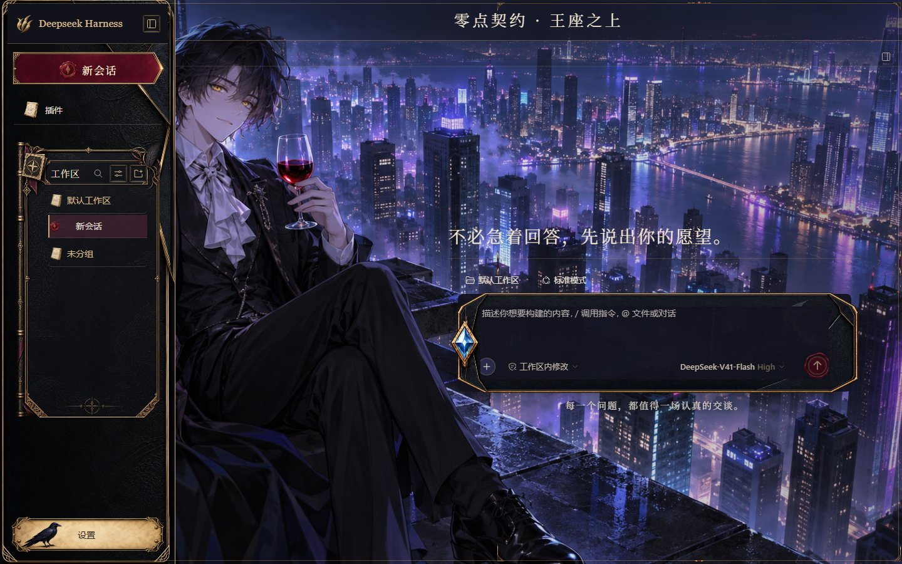

# Midnight Contract · Deepseek Harness skins

[中文](README.md)

Two self-contained asset skins for the Deepseek Harness Web GUI: **Moonlit Castle** and **Night City**. They share engraved dragon-leather panels, metal contract emblems, burgundy invitation plaques, a sapphire-envelope composer, wax seals, and parchment navigation, while keeping their individually authorized original backgrounds unchanged.

The masthead reads **Deepseek Harness** and has no upper-left character portrait. Its 64px brand row, workspace title/actions, and metal spine retain separate space. Generated materials decorate the host's real controls rather than replacing their behavior.

| Skin | ID | Details |
| --- | --- | --- |
| Moonlit Castle | `midnight-contract` | [Skin documentation](skins/midnight-contract/README.md) |
| Night City | `midnight-contract-city` | [Skin documentation](skins/midnight-contract-city/README.md) |

## Actual GUI captures

These are real captures of the official DSH 0.1.7-rc.1 Web GUI, rather than generated design mockups.

| Moonlit Castle · dark | Night City · dark |
| --- | --- |
|  |  |

| Moonlit Castle · light | Night City · light |
| --- | --- |
|  |  |

Additional [conversation/code](skins/midnight-contract/preview/conversation-code-dark.png), [model settings](skins/midnight-contract/preview/models-dark.png), and [narrow-screen](skins/midnight-contract/preview/mobile-root.png) captures are included. Conversation content ran through the real Agent and readonly tool using a clearly labeled local protocol fixture. No external model inference or injected DOM reply was involved.

The supplied real-GUI records contain 80 passing cases across 1440×900 desktop and 390×844 narrow layouts, light/dark themes, brand width, the portrait-free brand row, workspace controls, composer, menus, model settings, collapsed sidebar, and restoration. See the [Moonlit Castle verification](skins/midnight-contract/VERIFICATION.md) and [Night City verification](skins/midnight-contract-city/VERIFICATION.md). These records do not establish compatibility with every model provider or DSH release, or human visual acceptance.

## Install both skins

Use the real Deepseek Harness Web GUI with the skin-center v2 loader. The verified host version is DSH 0.1.7-rc.1. This repository is an asset pack; it contains no standalone HTML app, backend, executable hook, or host plugin installer.

1. Download or clone this repository.
2. Copy the complete `skins/midnight-contract` and `skins/midnight-contract-city` directories into the host's user skin directory, usually `$DSH_HOME/skins/`.
3. Open **Settings > Skins** in the real GUI and select either skin. The layout must be `skins/<id>/skin.json`, without an extra repository directory around it.

Skin directory precedence is `DSH_SKINS_HOME`, `DSH_SKINS_DIR`, then the host-resolved `DSH_HOME/skins`. A normal default installation usually uses `.dsh/skins` under your home directory; custom installation/profile layouts must use the actual host location.

Windows example, from this repository's root: set `$skinHome` to the real host directory before copying.

```powershell
$skinHome = Join-Path $env:USERPROFILE '.dsh\skins'
New-Item -ItemType Directory -Force -Path $skinHome | Out-Null
Copy-Item -LiteralPath '.\skins\midnight-contract' -Destination $skinHome -Recurse
Copy-Item -LiteralPath '.\skins\midnight-contract-city' -Destination $skinHome -Recurse
```

Linux/macOS example for a normal default installation; adjust the destination for custom `DSH_HOME` or skin directory overrides:

```sh
mkdir -p "$HOME/.dsh/skins"
cp -R skins/midnight-contract skins/midnight-contract-city "$HOME/.dsh/skins/"
```

Switch to another skin or the default appearance before deleting an unwanted skin directory. Skins do not rewrite model configuration, credentials, or host startup configuration. Wallpaper Engine, manual-background, and skin-background precedence remains owned by the skin center. Independent distribution here does not mean the skins are listed in the official Workshop.

## Artwork and licenses

Independent styles, repository scripts, and contributor-authorized supplied/generated assets use [Apache-2.0](LICENSE). Each pack retains its own [Moonlit Castle notice](skins/midnight-contract/NOTICE.md), [Night City notice](skins/midnight-contract-city/NOTICE.md), asset provenance, and generation prompts. The older Steam Workshop wallpaper is excluded.

[Third-party notices](THIRD-PARTY-NOTICES.md) preserve the dsh-skins contract/scaffold attribution, its BSD-3-Clause text, and copyright. No ownership of the Dragon Raja franchise or its characters, or official endorsement, is claimed. Provenance records capture the contributor's authorization declaration; automated checks cannot establish legal ownership.

## Local quality gates

Use Node.js 24 or newer and pnpm 11.24.0. The validator uses only Node built-ins and has no runtime or development dependencies.

```sh
pnpm install --frozen-lockfile --ignore-scripts
pnpm typecheck
pnpm test
pnpm docs:check
pnpm check
```

| Command | Actual scope |
| --- | --- |
| `typecheck` | `node --check` checks the two JavaScript files' syntax; this is not TypeScript typechecking |
| `test` | Validator regressions for escaping paths, encoded/escaped bypasses, remote URLs, missing assets, invalid links, and altered original artwork |
| `docs:check` | Existing repository-local Markdown/image targets within the repository; no network checks of external links |
| `check` | Both skins' v2 required fields, pure-asset constraints, CSS resources, pinned original SHA-256, provenance, and local documentation |

Background bytes, `asset-provenance.json`, and fixed original hashes in the validator must agree. Changing both an image and its recorded digest still fails. Traversal and symlinks cannot make resources leave a skin directory. This is a package acceptance checker, not the full DSH schema/CSS security parser or a rerun of browser validation.

This repository's GitHub workflow runs the same commands. Upstream CI outcomes do not establish this repository's success; consult its own Actions runs for actual status.
