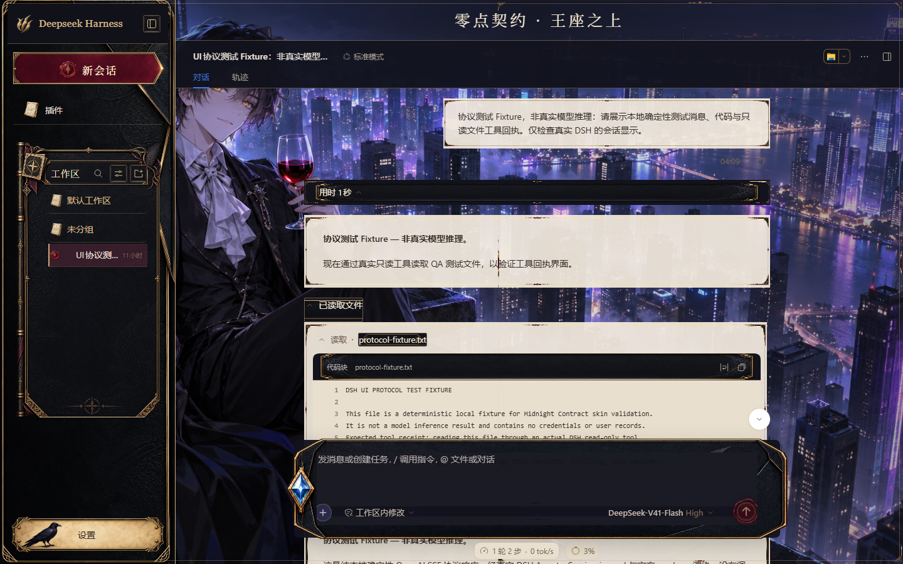
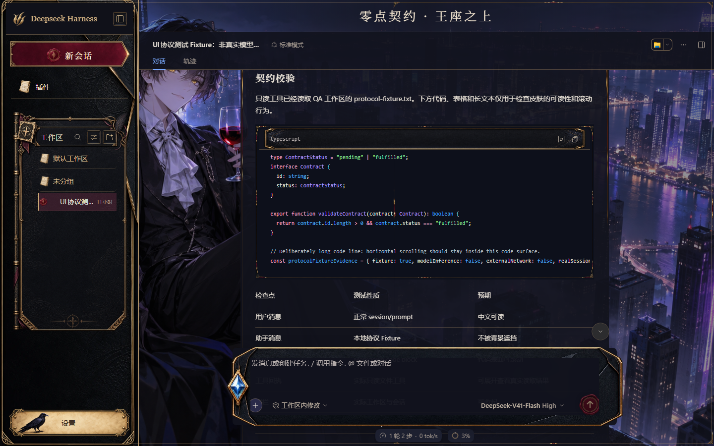

# 零点契约 · 夜城

[English](README.md) | 中文

为真实 DeepSeek Harness Web GUI 制作的路鸣泽／龙族主题皮肤。夜城版使用贡献者指定的原始背景，紧凑的 Deepseek Harness 品牌栏与独立生图材质共同组成契约界面；[另一版本](../midnight-contract/README.zh.md)沿用同一套组件语言并更换场景。

## 真实预览

以下截图来自 DSH 0.1.7-rc.1 实际 GUI，不是生成概念图。模型名称为宿主默认标签；验证未调用模型，也没有伪造智能体回复。

| 浅色 | 深色 |
| --- | --- |
|  |  |

更多真实截图见 [preview/](preview/)，覆盖状态与限制见[验证说明](VERIFICATION.md)。

## 定制范围

- 龙纹皮革侧栏、Deepseek Harness 品牌栏与绯红邀约底板；按最新要求取消左上角头像区域。
- 生图制作工作区卷宗、金属书脊、鸦羽角饰及工作区／会话图标，保留原生滚动、搜索和管理操作。
- 蓝宝石信封输入框和红色发送封蜡；附件、权限和模型选择继续使用真实控件。
- 下拉菜单、模型卡片与消息／工具区域复用生成的契约框；输入字段、操作按钮与开关分别使用独立材质和蓝宝石拨钮。
- 浅色设置页使用象牙色正文，深色设置页使用午夜蓝正文；两者保留黑金侧栏与契约输入框。
- 桌面首页文案移至右侧，为原图左侧人物留出空间；支持收起侧栏和窄屏，600px 以下设置导航改为顶部横向排列。

## 安装与恢复

将本目录完整复制到皮肤中心用户目录，默认是 `$DSH_HOME/skins/midnight-contract-city/`，再从真实 DSH GUI 设置页选择；显式设置 `DSH_SKINS_HOME` 时以该目录为准。

这是皮肤资产包，需 DSH Web 宿主及皮肤中心 v2 加载器，不能当作独立 HTML 打开。切回其他皮肤或无皮肤即可恢复。背景优先级继续由控制器管理：Wallpaper Engine > 用户手动背景 > 皮肤背景。

## 接入方式与边界

所有样式由控制器限定在 `html[data-dsh-skin="midnight-contract-city"]`。`skin.css` 提供 L1 色彩变量和 L2 语义表面，`patches.css` 明示使用 L3 接缝，覆盖实际侧栏、输入卡片、设置导航、模型编辑器、开关拨钮和菜单。选择器依赖语义属性与稳定类名后缀，不依赖构建哈希或匹配文案。

皮肤无可执行 hook、远程资产、模型行为修改、凭据处理和后端配置。技能、任务、SSH 等插件入口只有真实安装对应插件时才出现，不通过装饰伪造导航功能。功能文字保持 DOM 输出；输入框不添加 backdrop-filter，毛玻璃和固定提示框定位由控制器负责。

## 素材与许可

详见[素材声明](NOTICE.md)、[来源记录](asset-provenance.json)、[生成提示词](generation-prompts.json)及仓库 [Apache-2.0 许可](LICENSE)。背景由贡献者提供并确认公开再分发权，文件哈希记录在来源清单中；左上角头像区域已移除。包中不包含此前的 Steam 创意工坊角色壁纸。UI 装饰由 OpenAI image_gen 生成，不主张龙族 IP 的所有权或官方背书。

## 开发与验证

本目录最初在 dsh-skins 使用标准脚手架 `node scripts/dsh-skin-new.cjs midnight-contract-city` 生成。[独立分发仓库](https://github.com/Theater-ahyeon/midnight-contract-skins)提供以下实际检查：

```sh
pnpm typecheck
pnpm test
pnpm docs:check
pnpm check
```

此处 `typecheck` 为 JavaScript 语法检查，不是 TypeScript 类型检查。这些命令校验资源和文档，真实宿主运行证据另见 VERIFICATION.md。上游贡献还经过官方目录／CSS 安全、hooks、构建和类型检查。本皮肤无需单独构建；宿主升级后需复核类名接缝与截图。[创意工坊贡献 PR](https://github.com/zhu1090093659/dsh-skins/pull/33)仍需上游审阅，独立分发不表示已在市场上架。

## 真实会话验证

以下为官方宿主运行截图，内容明确标注本地协议 Fixture。消息经过真实 Agent 与只读工具；未调用外部模型，也未注入页面回复。

| 工具回执 | 代码界面 |
| --- | --- |
|  |  |
