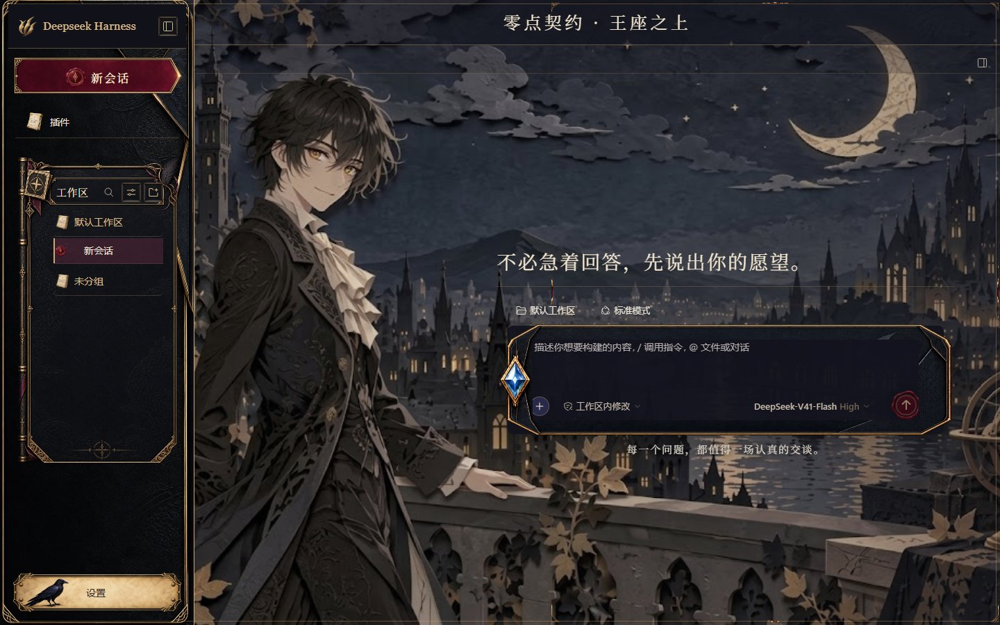
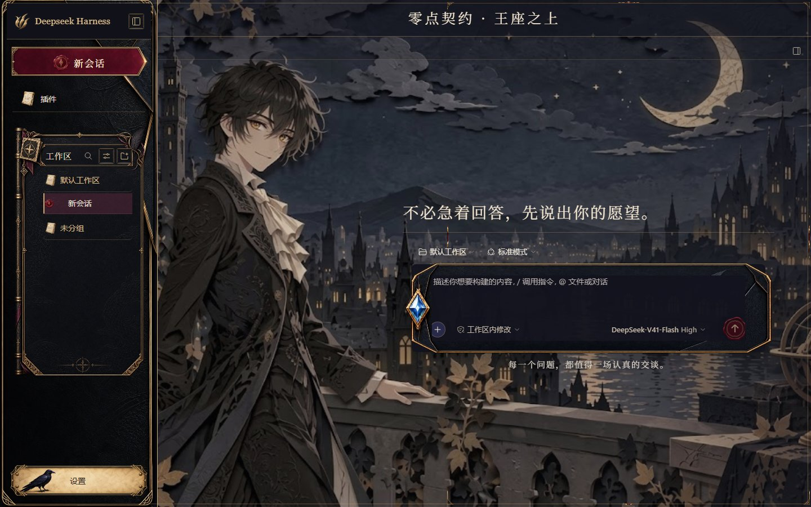

# 零点契约

[English](README.md) | 中文

为 Deepseek Harness Web GUI 制作的黑金契约皮肤。0.1.3 沿用 0.1.2 引入的无人风景、Deepseek Harness 品牌栏和已有 AI 界面材质，增加 Wallpaper Engine 长回复阅读遮罩保护，只在实际助手正文上绘制一层装饰框，并让分析摘要使用平面底板及原生布局。

## 预览

| 亮色 | 暗色 |
| --- | --- |
|  |  |

另见[窄屏界面](preview/mobile-root.png)。预览已基于最终 0.1.3 CSS 重新拍摄，空会话图片字节与 0.1.2 相同；当前回执记录本版 Web GUI 结果，原生 0.1.2 证据明确保留为历史。截图来源、宿主版本及验证边界见[VERIFICATION.md](VERIFICATION.md)。

## 界面

- 压纹皮革侧栏、金属契约徽记、Deepseek Harness 品牌栏与绯红邀约底板。
- 沿用生成的工作区卷宗、金属书脊、羽饰和文件夹／会话图标；边框随实际滚动区域高度伸缩，保留原生滚动与管理操作。
- 蓝宝石信封输入框与红色发送封蜡；附件、权限和模型选择保持真实控件。
- 契约框、雕纹输入底板、操作底板与蓝宝石拨钮装饰宿主实际控件。
- 浅色设置页使用象牙色正文，深色设置页使用午夜蓝正文；两者保留黑金侧栏与输入框。
- 新会话输入区使用宿主默认布局；支持收起侧栏和窄屏，600px 以下设置导航改为顶部横向排列。

## 安装与恢复

将本目录完整复制到 `$DSH_HOME/skins/midnight-contract/`，再从真实 GUI 设置页选择。`DSH_SKINS_HOME` 与 `DSH_SKINS_DIR` 可以覆盖皮肤路径。资产包需要 DSH Web 宿主和皮肤中心 v2 加载器。

切回其他皮肤或无皮肤即可恢复。背景优先级由宿主控制器管理：Wallpaper Engine > 用户手动背景 > 皮肤背景。

## 接入方式

控制器将样式限定在 `html[data-dsh-skin="midnight-contract"]`。`skin.css` 提供 L1 色彩与 L2 语义表面；`patches.css` 明示使用 L3 接缝，覆盖实际侧栏、输入框、设置、模型编辑器、拨钮和菜单。选择器使用语义属性与类名后缀。

插件入口只装饰宿主实际提供的功能。功能文字保持 DOM 输出，装饰不拦截点击；皮肤不再插入会话页顶栏或叙事提示。实际助手正文使用一层契约框和阅读遮罩，语义消息外层不再重复套框；正文底色保护规则用于抵抗 Wallpaper Engine 的表面清除，最终源码的亮暗主题图片和 WE 视频检查均保留 0.93 遮罩。分析摘要不再套装饰底板或边框，保留宿主原有内边距和边框。毛玻璃及提示框定位由控制器负责。皮肤不包含可执行 hook 或远程资产。

## 素材与许可

无人背景于 2026-10-05 通过 Codex 内置 image_gen 为本项目生成，并于 0.1.2 引入。0.1.3 沿用原图片像素及记录中的 SHA-256，不主张重新生成素材。UI 图片沿用已有 OpenAI image_gen 素材，不将描述编辑说成新生图。公开 UI 提示词为整理后的通用材质摘要，不作为历史生成请求的逐字回执。

[Apache-2.0 LICENSE](LICENSE) 仅适用于独立编写的 CSS 与代码。背景、UI 图片与预览按 `LicenseRef-Personal-NonCommercial-Artwork` 仅供个人非商业使用，不授予第三方权益。项目与 dsh-skins、维护者及 Deepseek Harness 无官方关联或背书；权利人提出异议时移除相关素材并配合下架。

详见[素材声明](NOTICE.md)、[来源声明](SOURCE-DECLARATION.md)、[来源清单](asset-provenance.json)和[提示词记录](generation-prompts.json)。确切模型名与请求编号不作推测。

## 开发与验证

目录最初由上游 dsh-skins 标准脚手架生成。[独立分发仓库](https://github.com/Theater-ahyeon/midnight-contract-skins)提供以下包检查：

```sh
pnpm typecheck
pnpm test
pnpm docs:check
pnpm check
```

`typecheck` 为 JavaScript 语法检查。包校验、官方目录／CSS 安全门禁、真实宿主验证各有独立范围。0.1.3 Web GUI 结果、剩余官方门禁及 0.1.2 历史原生范围见[VERIFICATION.md](VERIFICATION.md)。创意工坊上架需维护者实际接收。
